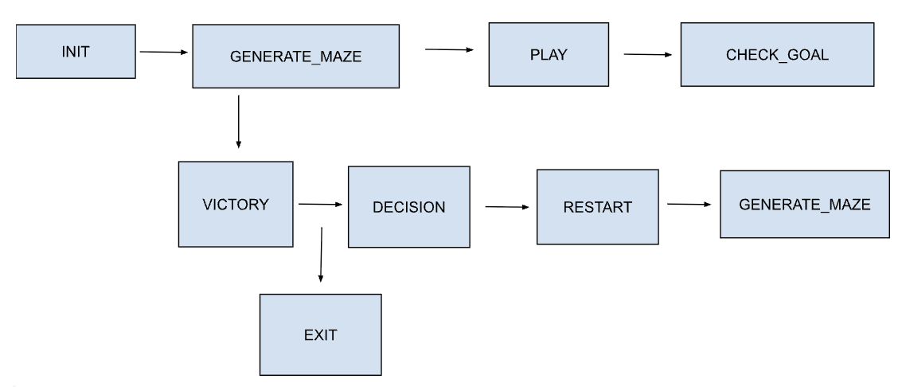
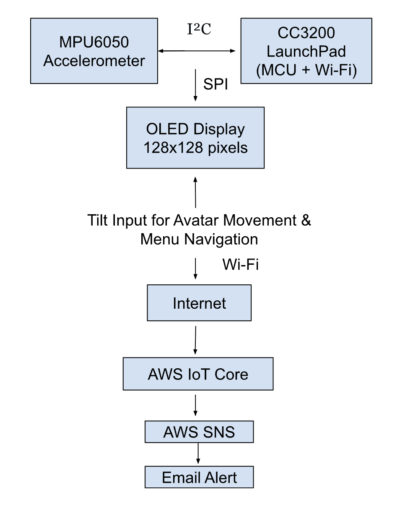

# Final Project Webpage
**EEC 172 Embedded Systems**   
**Team Members:** Brandon Wong, Rohit Singh  
**Under the sincere guidance of:** Professor Soheil Ghiasi and TA Rishad Joarder

---

## 1. Description

We designed and implemented an immersive tilt-controlled maze game using the CC3200 LaunchPad microcontroller platform. The system integrates an accelerometer to detect physical tilts, an OLED screen for rendering visuals, and a physical button for minimal interaction. The player maneuvers a digital avatar (represented as a dot) by tilting the board, navigating through a dynamically generated maze with the objective of reaching a designated exit point. New gameplay complexity is introduced by "ghost" obstacles that patrol the maze, forcing players to avoid collisions while planning their path. Upon reaching the exit, the game displays a celebratory message and prompts the user to either restart the game or exit.

This project serves as a demonstration of embedded systems, combining real-time motion sensing, dynamic graphics generation, and secure cloud communication. The game result (WIN or LOSE) is sent via HTTPS POST to AWS IoT Core, where it updates a Device Shadow. AWS Simple Notification Service (SNS) then triggers an email alert to subscribed users, illustrating a seamless connection between embedded hardware and cloud services.

---

## 2. Design

### 2.1 Functional Specifications

 

Our game is structured around a clear finite state machine, managing system behavior through the following key states:

**INIT:** Initializes hardware (I²C for accelerometer, SPI for OLED) using TI tools and loads AWS certificates.

**GENERATE_MAZE:** Uses a DFS algorithm with a timer-based seed to generate a unique maze, rendered as a 2D grid on the OLED.

**PLAY:** Reads tilt data from the MPU6050 to control the avatar. Ghost enemies move autonomously. Collision detection ends the game on contact.

**CHECK_GOAL:** Compares player’s position with the goal cell. If matched, transitions to the VICTORY state.

**VICTORY:** Displays a win message and sends a game result (as a JSON POST) to AWS IoT, triggering an SNS email alert.

**DECISION:** Asks the player whether to replay. Tilt-based menu selection allows choosing “Yes” or “No” via board movement and button input.

**RESTART / EXIT:** Restart clears the game and regenerates a maze; Exit displays a goodbye message and halts the program.

This modular state design ensures smooth transitions, robust gameplay logic, and seamless cloud communication.

### 2.2 System Architecture

The system integrates real-time sensing, interactive graphics, and cloud communication to deliver a responsive and connected embedded experience:

**MPU6050 Accelerometer:** Continuously streams tilt data to the CC3200 via I²C. This input controls avatar movement during gameplay and also enables menu navigation (e.g., selecting “Play Again: Yes/No”) after game completion.

**OLED Display (128x128):** Connected via SPI, it displays the maze, avatar position, win/lose messages, and replay menu options.

**CC3200 LaunchPad:** Serves as the central processor. It interprets accelerometer input, executes game logic, renders graphics on the OLED, and manages secure cloud communication with AWS services.

**Wi-Fi Module (onboard CC3200):** Sends game results (WIN/LOSE) to AWS using HTTPS POST requests.

**AWS IoT Core:** Receives and processes POST data by updating the device shadow.

**AWS SNS:** Responds to device shadow updates by sending automated email alerts to subscribed users.

---

## 3. Implementation 

We began by configuring the CC3200 LaunchPad using the TI Pin Mux Tool to set up I²C for the MPU6050 accelerometer and SPI for the OLED display. Certificates for AWS communication were converted and flashed using OpenSSL.

The maze is generated using a recursive DFS algorithm seeded with system timer values for randomness, rendered efficiently by updating only changed display regions.

In gameplay, player movement is controlled via real-time tilt data, filtered for smoothness. Autonomous ghost enemies follow fixed or random paths, with collision detection triggering a game-over screen and transition to a replay prompt.

Upon reaching the goal, the game sends a JSON payload via HTTPS POST to AWS IoT, which triggers an SNS email alert through a pre-configured rule.

Tilt-based input is reused for the “Play Again?” menu, with inverse-color feedback and a timeout-based auto-selection. Game restarts clear the display and regenerate the maze; exit shows a farewell message and halts the system.

---

## 4. Challenges

- **Noisy Accelerometer Readings:** Solved using a moving average filter

- **Maze Collision Bugs:** Refined wall indexing to prevent overlap or skipping walls

- **Screen Flickering:** Solved by partial display updates and segmented rendering

- **SSL Errors in AWS Connection:** Replaced outdated certificates and converted using OpenSSL

- **Wi-Fi Timing Conflicts:** Resolved by decoupling cloud code from game loop with non-blocking tasks

---

## 5. Future Work

- Add a scoring system (based on time or moves)

- Introduce multiple levels with progressive difficulty

- Store scores on AWS DynamoDB and visualize with a web dashboard

- Add sound output via PWM and potential multiplayer over cloud

---

## 6. Bill of Materials

| Component              | Quantity | Source          | Cost (USD)|
|----------------------- |----------|-----------------|-----------|
| CC3200 LaunchPad       | 1        | TI              | $29.99    |
| OLED Display (SPI)     | 1        | Adafruit/Amazon | $12.95    |
| Accelerometer (MPU6050)| 1        | Amazon          | $5.00     |
| Breadboard & Jumpers   | 1        | Amazon          | $5.00     |
| USB Cable              | 1        | Amazon          | $5.00     |
| TLS Certificate Setup  | -        | AWS IoT         | Free      |

---

## 7. Video Demo

https://github.com/user-attachments/assets/c8e9d327-cc07-401e-b89b-79392c25274e

---

> Built with ❤️ by Brandon Wong & Rohit Singh  
> UC Davis — Spring 2025
